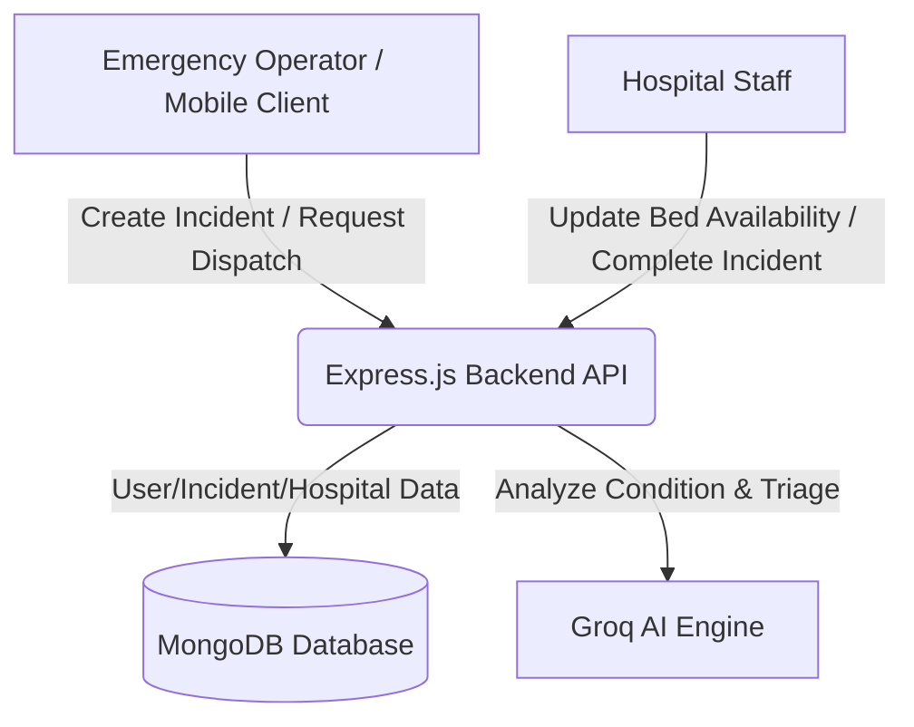

# RapidCare — AI-Powered Ambulance Dispatch System

**RapidCare** is a full-stack emergency management application that leverages artificial intelligence to analyze incoming patient conditions, prioritizing severity and matching them in real-time with the nearest available hospital based on medical specialization and current bed capacity.

---

## 🏗️ Architecture



---

## 🚀 Quick Start

### Prerequisites
* **Node.js** (v18 or higher)
* **MongoDB** (Local instance or MongoDB Atlas cluster)
* **Groq API Key** (For emergency condition triage and matching)

### Backend Setup
1. Navigate to the backend directory:
   ```bash
   cd backend
   ```
2. Install dependencies:
   ```bash
   npm install
   ```
3. Set up your environment variables:
   ```bash
   cp .env.example .env
   # Open .env and add your connection string, secrets, and Groq API key
   ```
4. *Optional:* Seed the database with sample mock hospitals and operators:
   ```bash
   node seedData.js
   ```
5. Start the development server:
   ```bash
   npm run dev
   ```

### Frontend Setup
1. Navigate to the frontend directory:
   ```bash
   cd ../frontend
   ```
2. Install dependencies:
   ```bash
   npm install
   ```
3. Set up your environment configuration:
   ```bash
   cp .env.example .env.local
   # Open .env.local and update REACT_APP_API_BASE_URL if needed
   ```
4. Start the React development client:
   ```bash
   npm start
   ```

---

## 🔧 Environment Variables

### Backend (`backend/.env`)
```env
PORT=5000
MONGODB_URI=mongodb://localhost:27017/rapidcare
JWT_SECRET=your_jwt_secret_here
GROQ_API_KEY=your_groq_api_key_here
CORS_ORIGIN=http://localhost:3000
```

### Frontend (`frontend/.env.local`)
```env
REACT_APP_API_BASE_URL=http://localhost:5000
```

---

## 📚 API Documentation

### Authentication
* **`POST /api/auth/register`** — Register a new operator or hospital staff user.
* **`POST /api/auth/login`** — Authenticate credentials and return a JWT access token.

### Incidents
* **`POST /api/incidents`** — Create an emergency incident *(Operator only)*.
* **`GET /api/incidents/:id`** — Retrieve live incident details.
* **`PATCH /api/incidents/:id/dispatch`** — Dispatch ambulances and resource matching *(Operator only)*.
* **`PATCH /api/incidents/:id/complete`** — Resolve and close out an incident status *(Hospital Staff only)*.

### Hospitals
* **`GET /api/hospitals`** — List all registered medical centers.
* **`PATCH /api/hospitals/:id/availability`** — Live update of active bed availability and specialization counts *(Hospital Staff only)*.

---

## 📦 Deployment

### Backend (Render)
1. Commit and push your codebase to a remote **GitHub** repository.
2. Log into **Render** and click **New +** → **Web Service**.
3. Connect your GitHub repository.
4. Set the root directory configuration to your `backend` directory.
5. Apply the following settings:
   * **Build Command:** `npm install`
   * **Start Command:** `npm start`
6. Add your production credentials into **Environment Variables**:
   * `MONGODB_URI`
   * `JWT_SECRET`
   * `GROQ_API_KEY`
   * `CORS_ORIGIN` *(Set to your deployed Vercel URL)*

### Frontend (Vercel)
1. Log into **Vercel** and select **Import Project**.
2. Connect your GitHub repository.
3. Select the `frontend` folder as the root directory.
4. Choose **Create React App** as the framework preset.
5. Apply the following configurations:
   * **Build Command:** `npm run build`
   * **Output Directory:** `build`
6. Add the following **Environment Variable**:
   * `REACT_APP_API_BASE_URL` *(Set to your deployed Render backend URL)*
7. Click **Deploy**.

---

## 🎯 Demo Credentials

To explore different user control workflows within the client dashboard, use these testing profiles:

| Role | Username | Password |
| :--- | :--- | :--- |
| **Emergency Operator** | `operator@rapidcare.com` | `password123` |
| **Hospital Staff** | `staff@rapidcare.com` | `password123` |

---

## 🔒 Security Measures
* Strict **JWT-based authentication tokens** on protected endpoints.
* **Role-Based Access Control (RBAC)** ensuring clear division of capabilities between Operators and Staff.
* Strong, salt-protected **password hashing with bcrypt**.
* Configured **CORS policy layers** preventing unauthorized cross-origin resource requests.
* Isolated and managed application secrets via runtime **environment variables**.

---

## 📝 License

Distributed under the [MIT License](LICENSE). Feel free to use, modify, and distribute this software.
